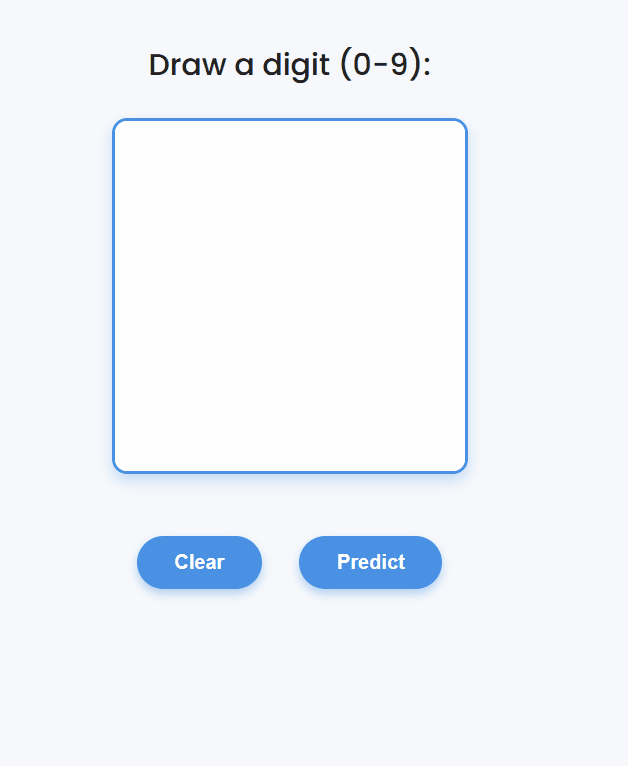

# Digit Recognizer Web App

This project is an interactive web application that recognizes handwritten digits drawn on a canvas. It is built using TensorFlow for digit classification and Flask for backend deployment. The app allows users to draw digits (0–9), sends the drawing to a trained model, and predicts the digit in real time with a clean and simple user interface.

The backend is powered by a convolutional neural network (CNN) trained on the MNIST dataset. The frontend provides a responsive canvas where users can draw digits, clear the canvas, and get predictions instantly without reloading the page.

---

## Features

- Draw digits from 0 to 9 using mouse or touch input on a canvas.  
- Real-time digit prediction using a CNN model.  
- Clean and aesthetic UI with responsive buttons and styles.  
- Easy to run locally with minimal setup.  

---

## Demo

## How to Use

Clone this repository to your local machine. The project files are organized in separate folders as follows:

- `app.py` contains the Flask backend and server code.  
- `digit_model.h5` is the pre-trained TensorFlow digit recognition model.  
- `train_model.ipynb` is the Jupyter notebook used to train the CNN model.  
- The `templates/` folder contains `index.html` for the frontend interface.  
- The `static/` folder contains supporting files such as `script.js` for frontend JavaScript and `styles.css` for CSS styling.

To run the app, first install the required Python packages (Flask, TensorFlow, Pillow, NumPy, etc.). Then run:

